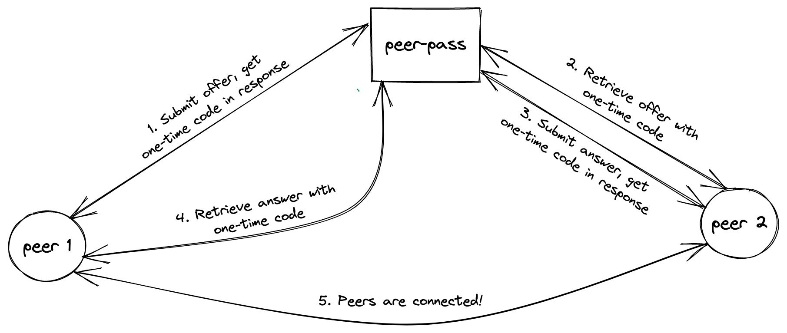

# peer-pass
A service facilitating in connecting peers together.

## Background
peer-pass can be thought of as a signaling storage API. It does not prescribe how the one-time codes get from one peer to another.

The primary benefit of peer-pass is in simplifying the transfer of an SDP from one peer to another. Instead of copy/pasting or attempting to send the SDP directly from one peer to another, you only need to send the one-time code.

There are of course alternatives to this approach that don't require peers to exchange these SDP's themselves, or even one-time codes for that matter. Those models typically involve WebSockets, polling requests, and/or Server Sent Events. There are multiple ways to approach this. peer-pass takes a simpler stance here and may or may not suit your needs.

## API
The API documentation can be found at:  
https://peer-pass.com

There are 2 endpoints:
- /api/peer/submit
    - Used to submit an offer or answer SDP for a fellow peer to then retrieve.
- /api/peer/retrieve
    - Used to pick up an offer or answer SDP that a fellow peer has submitted